<div align="center">

# 🚗 第十九届全国大学生智能汽车竞赛（折线电磁组）

**高速自动驾驶小车 | 山东赛区二等奖**


</div>

---

## 📖 项目简介

本项目为第十九届全国大学生智能汽车竞赛（折线电磁组）参赛作品，由**北京交通大学**「兰博基尼」队完成，并荣获**山东赛区二等奖**。

车辆采用 **F 型车模**，以 **STC32F12K** 为主控芯片，融合**电磁传感器 + TOF + 陀螺仪 + 编码器**多传感器方案，通过自主设计的三块 PCB 完成硬件实现，在 Keil C251 环境下编写全套底层控制代码，最终成功应对赛道中的**障碍物、环岛、坡道**等复杂场景，实现高速稳定的自动驾驶。

> 本仓库作者担任**队长**，负责 **PCB 硬件设计、底层控制代码编写及赛道实车调试**。

---

## 🏆 获奖信息

| 竞赛届次 | 赛题组别 | 参赛学校 | 队伍名称 | 奖项 |
|:---:|:---:|:---:|:---:|:---:|
| 第十九届 | 折线电磁组 | 北京交通大学 | 兰博基尼 | 山东赛区二等奖 |

---

## 🛠️ 技术挑战与工程复盘

### 复杂电磁环境下的元素识别优化
在决赛现场，小车面临不同赛道电磁场强分布不均的严峻挑战。以下是针对一次典型“元素误判”问题的调试复盘：

* **问题现象**：小车在决赛赛道的特定直线段出现非预期的突然转向动作。
* **根因分析 (Root Cause Analysis)**：
    * **实地调研**：通过手持电磁传感器对不同赛段进行对比测试。
    * **数据结论**：发现该直线段由于环境干扰，局部电磁强度异常波动。该波动特征在原有算法中达到了“环岛 (Roundabout)”元素的判别阈值，导致系统产生**伪触发 (False Positive)**。
* **解决方案**：
    1.  **特征重新标定**：分析并提取了直线段干扰信号与真实环岛信号的特征差异。
    2.  **阈值压缩策略**：收紧环岛判别的逻辑阈值区间，实现了“精准过滤”——既排除了特定直线段的强干扰，又保留了对真实环岛元素的敏感度。
* **最终结果**：经现场快速迭代验证，小车成功克服环境干扰，稳定通过该路段并圆满完赛。

---

## 🖼️ 实物展示

### 车模外观

<table>
  <tr>
    <td align="center"><b>俯视图</b></td>
    <td align="center"><b>左视图</b></td>
    <td align="center"><b>前视图</b></td>
  </tr>
  <tr>
    <td>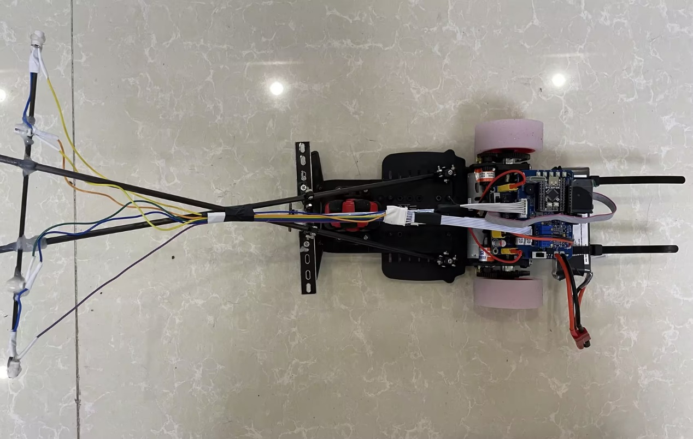</td>
    <td>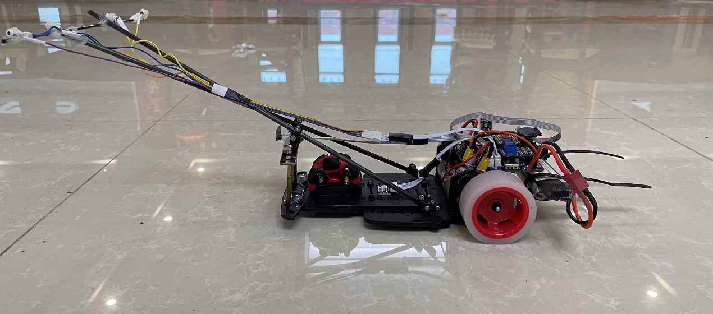</td>
    <td>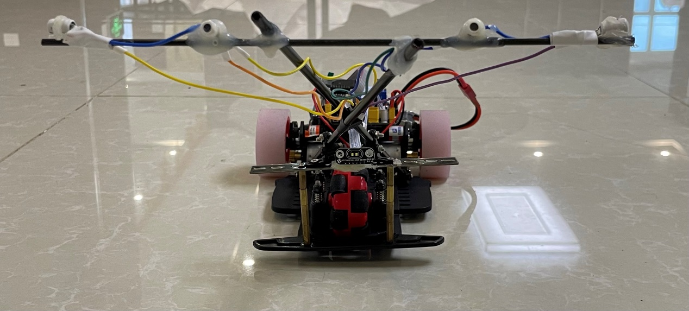</td>
  </tr>
</table>

### PCB 实物图

<table>
  <tr>
    <td align="center"><b>主板 · 正面</b></td>
    <td align="center"><b>主板 · 背面</b></td>
  </tr>
  <tr>
    <td>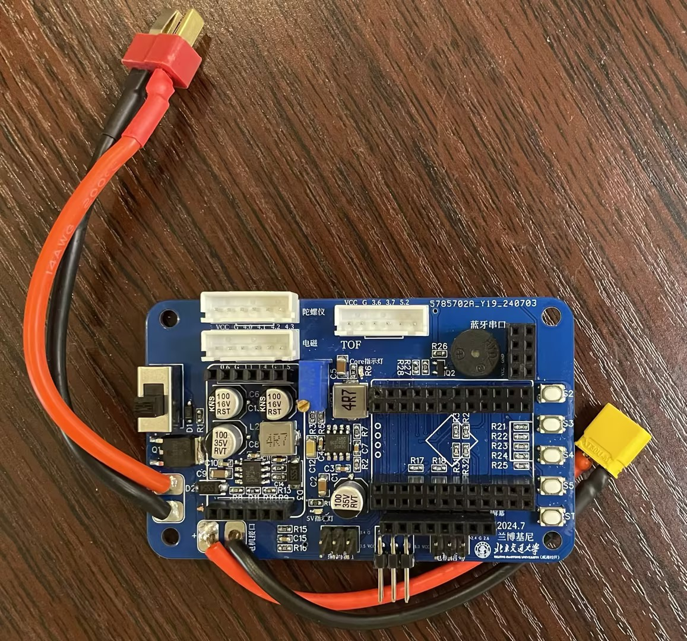</td>
    <td>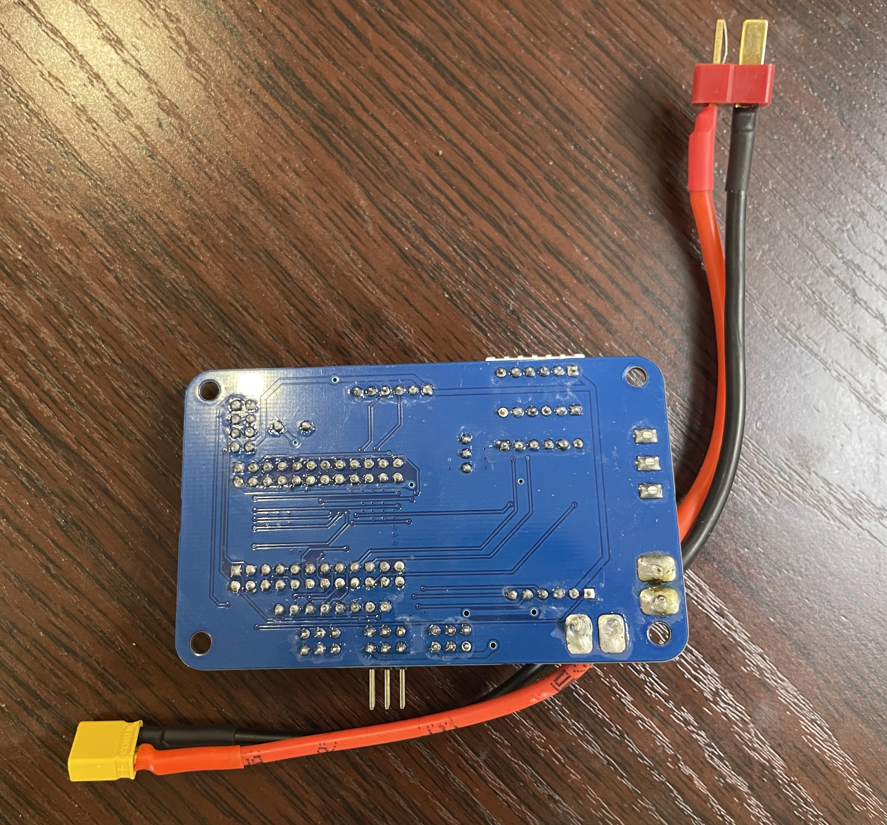</td>
  </tr>
  <tr>
    <td align="center"><b>运放板 · 正面</b></td>
    <td align="center"><b>运放板 · 背面</b></td>
  </tr>
  <tr>
    <td>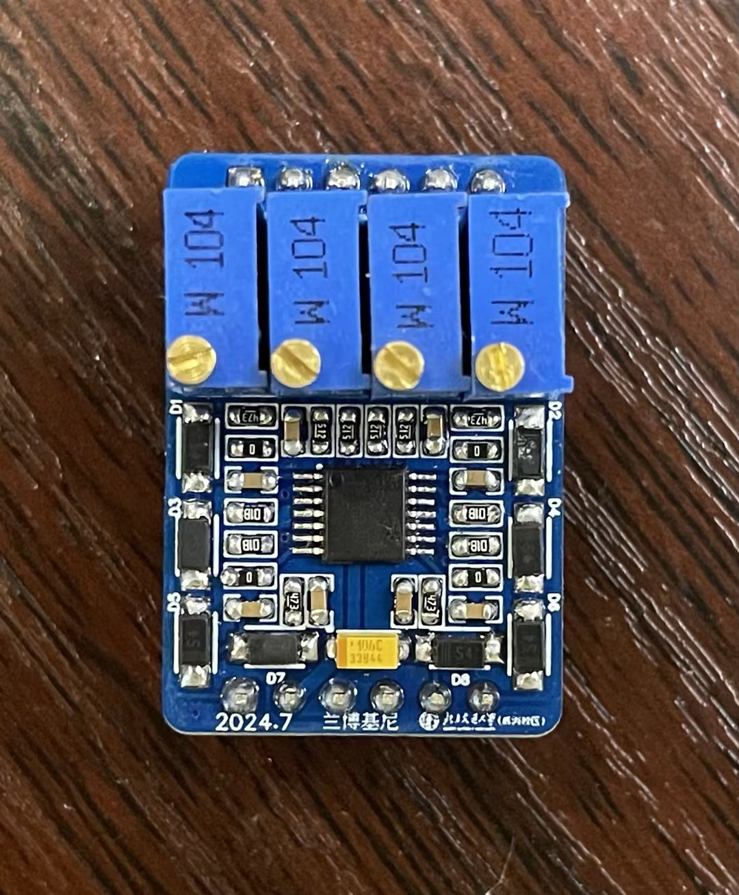</td>
    <td>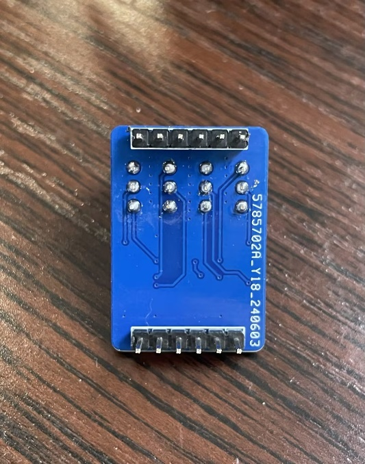</td>
  </tr>
  <tr>
    <td align="center"><b>驱动板 · 正面</b></td>
    <td align="center"><b>驱动板 · 背面</b></td>
  </tr>
  <tr>
    <td>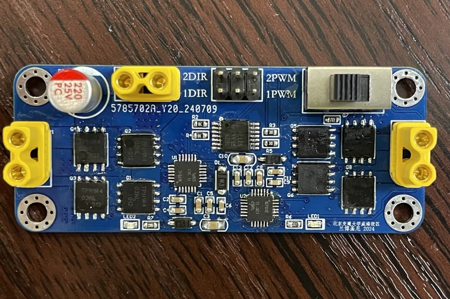</td>
    <td>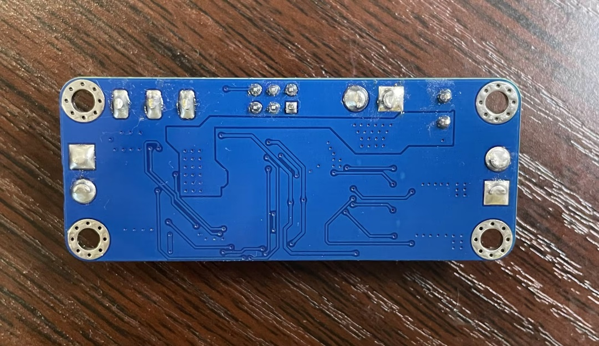</td>
  </tr>
</table>

### 🎬 比赛视频

> 📌 **占位符：** 请将比赛现场视频上传至 B站 / YouTube，并将链接替换到此处。
>
> [](https://www.bilibili.com/YOUR_VIDEO_ID)

---

## 🔧 硬件方案

### 整体架构

```
┌─────────────────────────────────────────────────────┐
│                   STC32F12K 主控                     │
├──────────┬──────────┬──────────┬────────────────────┤
│ 电磁传感器│ TOF(DL1B)│陀螺仪    │  编码器×2          │
│ (×4路ADC)│          │(IMU660RA)│  (左轮 / 右轮)     │
└──────────┴──────────┴──────────┴────────────────────┤
│                    信号处理层                         │
│   电感信号归一化 → 偏差计算 → 环境识别               │
├─────────────────────────────────────────────────────┤
│                    控制决策层                         │
│   速度 PID（增量式）/ 转向 PID（位置式）              │
├──────────────────────────┬──────────────────────────┤
│     电机驱动（PWM）       │     执行机构（差速转向）  │
└──────────────────────────┴──────────────────────────┘
```

### 传感器配置

| 传感器 | 型号 | 数量 | 用途 |
|:---:|:---:|:---:|:---|
| 电磁传感器 | 自制电感线圈 | 4 路 | 检测赛道中心线磁场，计算横向偏差 |
| TOF 测距 | DL1B | 1 个 | 障碍物检测，触发减速 / 绕行策略 |
| 陀螺仪 IMU | IMU660RA | 1 个 | 检测角速度，辅助坡道及过弯姿态控制 |
| 编码器 | 霍尔编码器 | 2 个 | 左右轮速度反馈，用于 PID 闭环 |

### PCB 设计（三板方案）

本项目自主设计并打样了三块 PCB，全部标注学校名称、队伍名称及日期：

| PCB 名称 | 主要功能 | 核心器件 |
|:---:|:---|:---|
| **主板** | 主控最小系统、电源管理、传感器接口 | STC32F12K、LDO 稳压、接插件 |
| **运放板** | 对 4 路电感信号进行放大与滤波 | 运算放大器、RC 滤波网络 |
| **驱动板** | 双路电机 H 桥驱动 | MOSFET H 桥、自举电路 |

### 原理图

| 主板原理图 | 运放板原理图 | 驱动板原理图 |
|:---:|:---:|:---:|
| 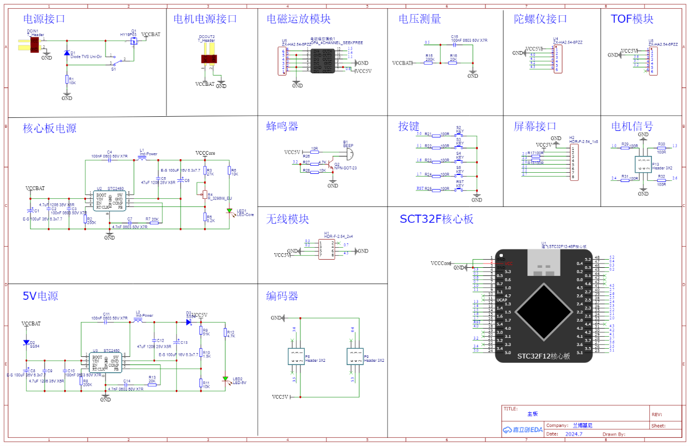 | 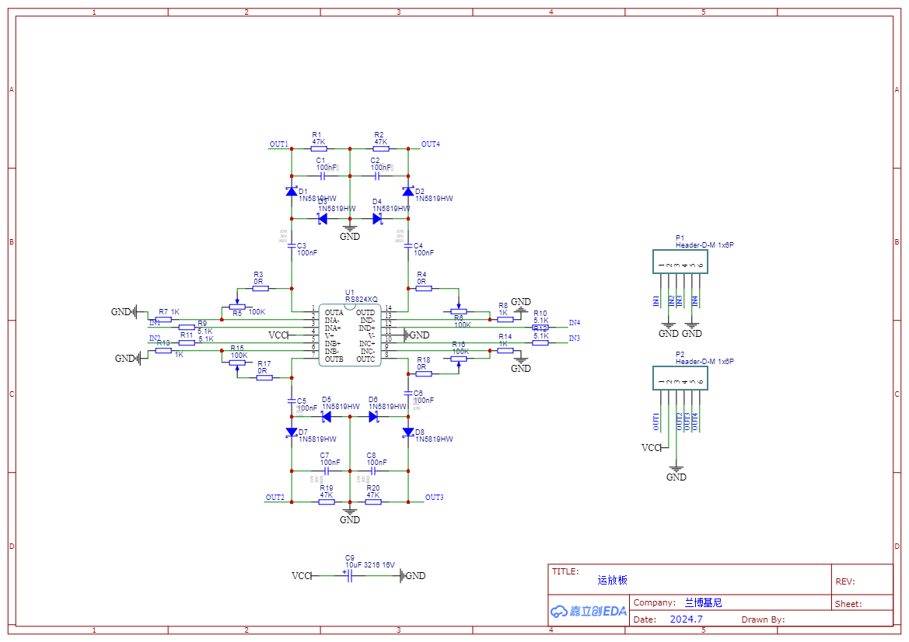 | 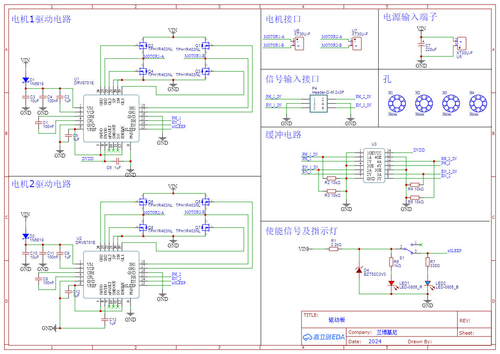 |

---

## 💻 软件与算法架构

### 代码模块划分

```
src/
├── main.c          # 主程序：初始化 + 主循环调度
├── Inductor.c      # 电感采样、归一化处理、偏差计算、速度计算
├── ADC.c           # ADC 多通道采样与滤波
├── PID.c           # 速度 PID（增量式）双路独立控制
├── element.c       # 赛道元素识别：障碍物 / 环岛 / 坡道
└── isr.c           # 中断服务程序：编码器计数、定时触发
```

### 核心算法说明

#### 1. 电磁循迹（Inductor.c）

采用 4 路电感线圈检测赛道中心线磁场，对原始 ADC 值进行**限幅 → 多次采样均值 → 归一化**处理后，利用差比和公式计算横向偏差：

```
偏差 error = (左侧ADC - 右侧ADC) / (左侧ADC + 右侧ADC)
```

#### 2. 速度 PID 控制（PID.c）

对左右轮分别实现**增量式 PID**，支持两套参数切换（直道高速 / 弯道低速）：

```c
// 增量式 PID：ΔU = Kp·Δe + Ki·e + Kd·(e - 2e₋₁ + e₋₂)
I_L = KP_L*(L_err[0]-L_err[1]) + KI_L*L_err[0] + KD_L*(L_err[0]-2*L_err[1]+L_err[2]);
PWM3 += I_L;  // 积分输出叠加
```

关键参数（最终调试结果）：

| 参数组 | Kp | Ki | Kd | 适用场景 |
|:---:|:---:|:---:|:---:|:---:|
| 直道（ZLPID） | 75 | 12 | 5 | 高速直道追速 |
| 弯道（WZPID） | 60 | 2 | 0 | 弯道 / 坡道稳定 |

#### 3. 赛道元素处理（element.c）

| 元素 | 检测方式 | 处理策略 |
|:---:|:---:|:---|
| 障碍物 | TOF 测距 < 阈值 | 提前减速，转向绕行 |
| 环岛 | 电感差值模式识别 | 切换环岛专用转向权重 |
| 坡道 | IMU 俯仰角变化 | 切换低速大扭矩参数 |

### 主循环时序

```
定时器中断（~5ms）
    │
    ├─ ADC 采样 → 电感信号处理 → 偏差计算
    ├─ 编码器读取 → 实际速度计算
    ├─ 元素识别 → 目标速度决策
    └─ PID 运算 → PWM 输出 → 驱动电机
```

---

## 📁 仓库目录结构

```
.
├── README.md                    # 项目说明文档（本文件）
│
├── src/                         # ⭐ 核心源代码（用户自编）
│   ├── main.c                   # 主程序入口
│   ├── Inductor.c               # 电磁传感器处理 & 速度采集
│   ├── ADC.c                    # ADC 采样模块
│   ├── PID.c                    # 双路增量式 PID 速度控制
│   ├── element.c                # 赛道元素识别
│   └── isr.c                    # 中断服务程序
│
├── project/                     # Keil C251 完整工程
│   └── Seekfree_STC32F12K_Opensource_Library/
│       ├── Project/MDK/         # Keil 工程文件 (.uvproj)
│       └── Libraries/           # Seekfree 底层驱动库
│
├── hardware/                    # 硬件设计文件（可选）
│   ├── main_board/              # 主板 PCB & 原理图工程文件
│   ├── opamp_board/             # 运放板 PCB & 原理图工程文件
│   └── driver_board/            # 驱动板 PCB & 原理图工程文件
│
├── images/                      # 图片资源
│   ├── car_photos/              # 车模实物照片
│   │   ├── car_top.jpg          # 俯视图
│   │   ├── car_left.jpg         # 左视图
│   │   └── car_front.jpg        # 前视图
│   ├── pcb_photos/              # PCB 实物正反面照片
│   │   ├── pcb_main_front.jpg
│   │   ├── pcb_main_back.jpg
│   │   ├── pcb_opamp_front.jpg
│   │   ├── pcb_opamp_back.jpg
│   │   ├── pcb_driver_front.jpg
│   │   └── pcb_driver_back.jpg
│   └── schematics/              # 原理图截图
│       ├── schematic_main.png
│       ├── schematic_opamp.png
│       └── schematic_driver.png
│
└── docs/
    └── 车模技术检查表.pdf        # 官方技术检查文档
```

---

## ⚡ 快速开始

### 环境依赖

| 工具 | 版本要求 | 用途 |
|:---:|:---:|:---|
| [Keil C251](https://www.keil.com/c251/) | v5.60+ | 编译 & 调试 STC32 工程 |
| [STC-ISP](https://www.stcmcudata.com/) | v6.90+ | 通过串口下载 .hex 固件 |
| [Seekfree 上位机](https://gitee.com/seekfree) | 最新版 | 实时串口调参 & 数据可视化 |

### 烧录步骤

```bash
# 1. 用 Keil 打开工程
project/Seekfree_STC32F12K_Opensource_Library/Project/MDK/SEEKFREE.uvproj

# 2. 编译工程，确认 0 Error 0 Warning

# 3. 打开 STC-ISP
#    - 芯片型号: STC32F12K64
#    - 串口:     选择连接车模的 COM 口（波特率 115200）
#    - 打开 HEX: Out_File/SEEKFREE.hex

# 4. 点击「下载/编程」，给车模重新上电完成烧录
```

### PID 参数调试建议

1. 先将速度目标值调低（约 50%），验证循迹方向正确
2. 在空旷直道逐步提升 `QW_speedL / QW_speedR` 目标速度
3. 通过 Seekfree 上位机实时观察 `error1`（偏差）和 `SJ_speedL/R`（实际速度）波形
4. 先调速度环 `KP_L / KR_L`，再调 `KI`，最后微调 `KD`

---

## 🛠️ 车模参数

| 参数 | 规格 |
|:---|:---|
| 车模型号 | F 型车模 |
| 整体尺寸 | 370mm × 250mm × 200mm |
| 主控芯片 | STC32F12K64（1T 8051 架构，最高 35MHz） |
| 电池规格 | 2200mAh 30C 7.4V 2S 锂电池 |
| 驱动方式 | 双后轮差速驱动（原装电机） |
| 转向方式 | 差速转向（无舵机） |
| 无线通讯 | 无 |

---

## 📄 License

本项目代码以 [MIT License](./LICENSE) 开源，PCB 设计文件仅供学习参考，转载请注明出处。

---

<div align="center">

Made with ❤️ by **兰博基尼队** · 北京交通大学威海校区 · 2024

</div>
